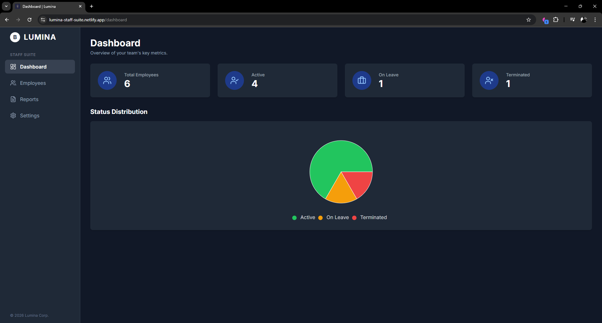

# Lumina Staff Suite - Frontend 🚀 

**Live Demo:** [https://lumina-staff-suite.netlify.app](https://lumina-staff-suite.netlify.app)



✨ **Features**

✅ **Full CRUD Functionality:** A complete module for managing employees (Create, Read, Update, Delete) with modals, search, and real-time updates.

📊 Reports & Export: A dedicated reports page with the ability to export all employee data to a .CSV file.

🌗 Advanced Settings:

Light/Dark Theme: Seamless theme switching with persistence in localStorage.

Multi-Language Support (i18n): Fully internationalized interface supporting 6 languages (UK, EN, DE, PL, FR, RO) using i18next.

⌨️ Command Palette: A powerful cmdk-based palette for quick navigation and actions with Ctrl+K.

📱 Fully Responsive: A clean, modern UI built with Tailwind CSS that works perfectly on all devices.

🔍 SEO Friendly: Basic SEO implemented using react-helmet-async for dynamic page titles and meta descriptions.

🏗️ Clean Architecture: A feature-based project structure with custom hooks for state management, promoting code reusability and maintainability.

### 🛠️ Tech Stack

| Category | Technology |
| :--- | :--- |
| **Core Frontend** | React (with Vite), TypeScript, Redux Toolkit, Tailwind CSS |
| **Forms** | React Hook Form (with Yup validation) |
| **Utilities** | date-fns |
| **API Client** | Axios |
| **Icons** | React Icons |
| **UI Components**|Custom modal, react-hot-toast, Skeleton Loading (Shimmer effect) |

## 🏁 Getting Started

To run this project locally, follow these steps:

**1. Clone the repository:**
```bash
git clone [https://github.com/toyo12312/lumina-staff-suite-frontend.git](https://github.com/toyo12312/lumina-staff-suite-frontend.git)
cd lumina-staff-suite-frontend
```

**2. Install dependencies:**
```bash

npm install

```

**3. Set up environment variables:**

Create a .env file in the root of the project by copying the example file:
```bash

cp .env.example .env

```
Then, update the .env file with your API endpoint:
```bash

VITE_API_URL=http://localhost:3000

```
**4. Run the development server:**
```bash

npm run dev

```
